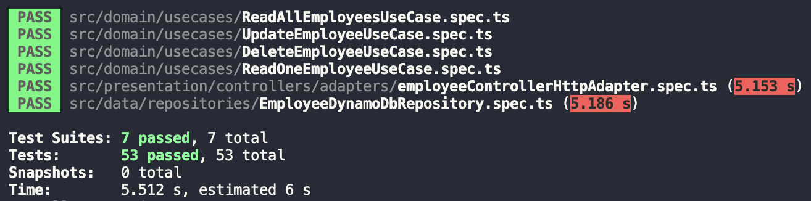

# **Desafio Stefanini**
O desafio consiste em criar um serviço que rode no AWS Lambda e seja possível adicionar, ler, atualizar e remover um funcionário.

## Tecnologias Utilizadas
* AWS Lambda
* DynamoDB
* Serverless Framework
* Serverless Offline
* Nodejs
* Typescript
* Jest
* Clean Arch
* TDD

## Estrutura do Projeto
O projeto foi dividido nas seguintes camadas:
- **Domain**
Possui as definiçoes das entidades, casos de usos, errors de domínio e interfaces para repositórios;
- **Data**
Possui implementaçoes concretas dos repositórios e também definiçao de interfaces para serviços necessários para o funcionamento dos repositórios;
- **Infra**
Possui implementacoes de serviços externos que serao utilizados na camada de dados;
- **Presentation**
Possui implementacao de controllers que serao responsaveis por invocar os casos de uso;
- **Main**
Responsável por instanciar a aplicaçao web e fazer injecao de dependencias;
- **Core**
Utilizada apenas para armazenar erros mais genéricos da aplicaçao.

### Entidades
```
Employee {

  employeeId: string

  name: string

  age: number

  role: string

}
```
## **Executando a aplicação**
É possível executar a aplicaçao fazendo um deploy através do **serverless framework**
```
serverless deploy
```
Ou utilizando o **serverless offline**
será necessário também a instalaçado do dynamodb local
```
sls dynamodb install
```
```
serverless offline start
```

## **Endpoints**
### Registrar novo funcionário
```POST``` /employee

body exemplo
```json
{
  "name": "Jane Doe",
  "age": 25,
  "role": "Seller"
}
```
### Buscar um funcionário
```GET``` /employee/:id

### Atualizar um funcionário
```PUT``` /employee/:id

body exemplo
```json
{
  "name": "Jane Doe Da Silva",
}
```

### Deletar um funcionário
```DELETE``` /employee/:id

## **Testes**
Os testes foram feitos utilizando Jest, então será necessário tê-lo instalado
```bash
npm t
```
Deverá aparecer os seguintes testes


